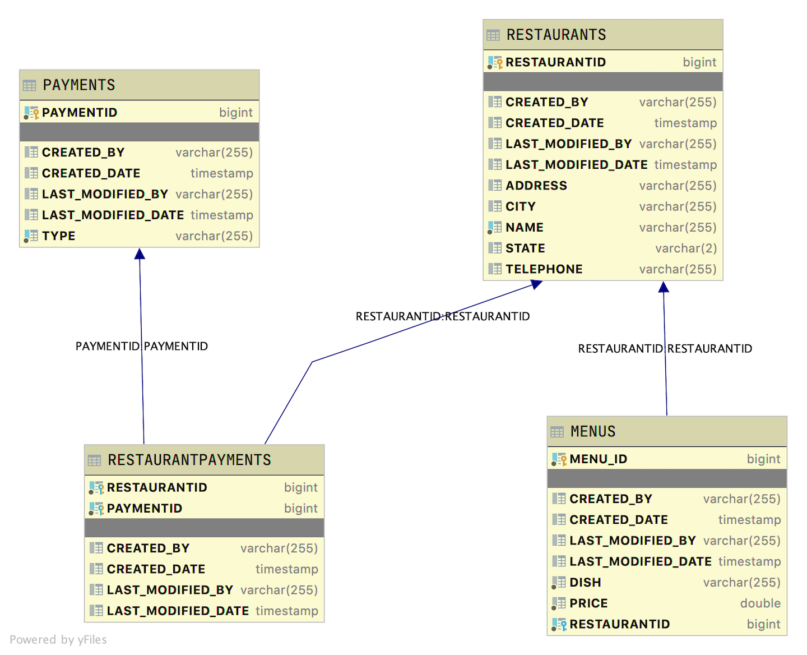

# Java Restaurants That Serve More than Coffee

A student that completes this project shows they can:

* explain what automated testing is and why it is important
* use JUnit to write, run, and interpret the output of unit tests for services with or without database access
* use JUnit to write, run, and interpret the output of unit tests for controllers
* implement Automated Integration Testing for REST APIs using JUnit and RestAssured

## Introduction

This is a basic database scheme with restaurants, menus, payment system. This Java Spring REST API application will provide endpoints for clients to read various data sets contained in the application's data.

### Database layout

The table layouts are as follows

* Restaurant is the driving table.
* Menus have a Many-To-One relationship with Restaurant. Each Restaurant has many menus. Each menu has only one Restaurant.
* Payments have a Many-To-Many relationship with Restaurants.
* Plus all the necessary tables for user authentication.

Default Swagger Documentation is enabled for this project. Run the project and look at the Swagger documentation to see the endpoints and their usages!

Unit and Integration tests will be added to this application
